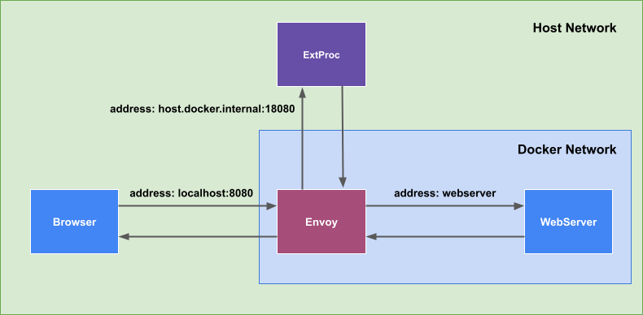

# Envoy External Processing Sample (ext_proc)

## Functions of each sample

* 01 Simple Proxy
    * Can be run as a proxy server where the Request Response does nothing but go through the ext_proc server.
* 02 Modifying the response body of a GET
    * Rewrite the response body of a GET request.
* 03 Return a 404 page
    * If Upstream returns status code 404, set a special HTML in the response body.
* 04 Sample extension of 03.
    * Return the corresponding HTML when Upstream response status code is 403, 404, 500 or 503.

## Requirements

```
go >= 1.17
Envoy >= 1.7.0
```

## Sample architecture



## Start Sample

### Step 1 Setup

```bash
git clone https://github.com/Himenon/envoy-ext-proc-sample.git
cd envoy-ext-proc-sample

# Install dependent packages for go
go mod download

# build docker image
docker-compose build
```

### Step 2 Start Demo Server

```bash
docker-compose up
```

Access the webserver directly

* `http://localhost:3000`

Return the targeted HTTP status from the webserver

* `http://localhost:3000/error?status=404`
* `http://localhost:3000/error?status=403`
* `http://localhost:3000/error?status=500`
* ...

[implementation of webserver](./example/webserver/server.ts)

### Step 3 Start the ext_proc server

You can start any sample you like.

```bash
go run sample/01-simple-proxy/main.go
go run sample/02-rewrite-get-response-body/main.go
go run sample/03-not-found/main.go
go run sample/04-status-code-mapping-response/main.go
```

If you want to change the gRPC address, run the following:

```bash
GRPC_ADDRESS=127.0.0.1:18080 go run sample/01-simple-proxy/main.go
```

## LICENSE

MIT

## Reference

* [salrashid123/envoy_ext_proc](https://github.com/salrashid123/envoy_ext_proc)
