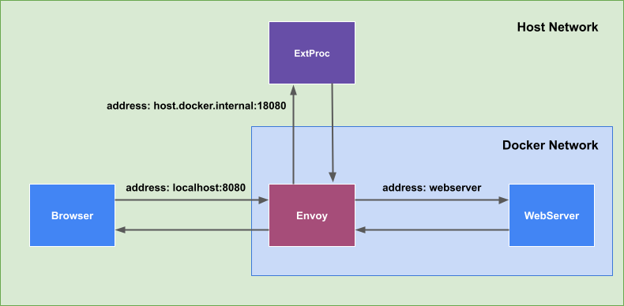

# Envoy External Processing Sample (ext_proc)

## 各サンプルの機能

* 01 シンプルなProxy
    * Request Responseがext_proc serverを経由するだけの何もしないProxyサーバーとして実行できます
* 02 GETのレスポンスボディを変更する
    * GETリクエストのレスポンスボディを書き換えます。
* 03 404ページを返す
    * Upstreamがstatus code 404を返した場合に、専用のHTMLをレスポンスボディにセットします。
* 04 03のサンプルを拡張したサンプル
    * Upstreamのレスポンスのステータスコードが403, 404, 500, 503のときに対応するHTMLを返す

## Requirements

```
go >= 1.17
Envoy >= 1.7.0
```

## サンプルのアーキテクチャ



## Start Sample

### Step 1 Setup

```bash
git clone https://github.com/Himenon/envoy-ext-proc-sample.git
cd envoy-ext-proc-sample

# Install dependent packages for go
go mod download

# build docker image
docker-compose build
```

### Step 2 Start Demo Server

```bash
docker-compose up
```

直接webserverにアクセスする

* `http://localhost:3000`

狙ったHTTPのstatusをwebserverから返す

* `http://localhost:3000/error?status=404`
* `http://localhost:3000/error?status=403`
* `http://localhost:3000/error?status=500`
* ...

[webserverの実装](./example/webserver/server.ts)

### Step 3 ext_procのサーバーを起動する

好きなサンプルを起動してください。

```bash
go run sample/01-simple-proxy/main.go
go run sample/02-rewrite-get-response-body/main.go
go run sample/03-not-found/main.go
go run sample/04-status-code-mapping-response/main.go
```

gRPCアドレスを変更したい場合は以下のように実行してください。

```bash
GRPC_ADDRESS=127.0.0.1:18080 go run sample/01-simple-proxy/main.go
```

## LICENSE

MIT

